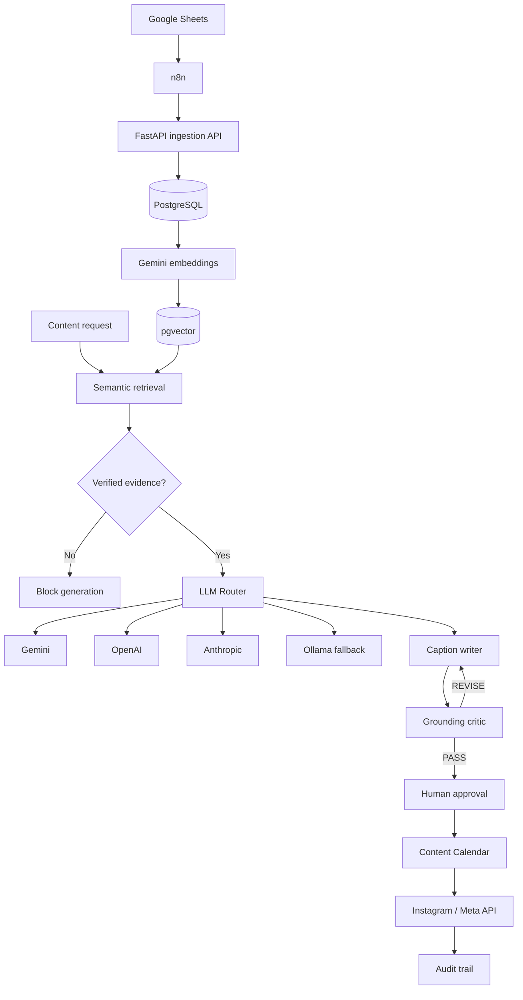

# Dhoni Instagram Agent

A self-hosted, production-oriented agentic AI platform for an MS Dhoni fan account.

The project ingests structured knowledge, generates embeddings, performs semantic retrieval, creates grounded Instagram captions, validates them with a critic, and routes LLM requests across multiple providers with a local Ollama fallback.

> **Project status:** Phase 3 — grounded generation and multi-provider LLM routing.

## Current capabilities

- Google Sheets knowledge ingestion through n8n.
- Knowledge storage in PostgreSQL.
- pgvector semantic embeddings and retrieval.
- Gemini embeddings.
- Grounded caption generation using verified evidence only.
- Critic + revision loop.
- Multi-provider LLM routing:
  - Gemini
  - OpenAI
  - Anthropic
  - Ollama (last-resort local fallback)
- Provider retry and fallback handling.
- Separate test database for integration tests.
- Audit events for ingestion operations.
- API endpoints for ingestion, indexing, retrieval, generation, and critic validation.

## Non-negotiable guardrails

- Never generate, alter, or identity-transform a Dhoni photograph or video.
- Never attribute a quote to Dhoni unless it is in the verified knowledge base with a source URL.
- Never generate publishable content from unverified knowledge.
- Keep evidence, prompts, decisions, approval state, and publishing results auditable.
- Enforce deterministic validation, licensing, approval, and idempotency rules outside the LLM.
- Keep credentials out of Git, prompts, workflow exports, and logs.
- Integration tests must use the dedicated test database and must never wipe the development database.

## Architecture



The baseline and target design are documented in [docs/architecture.md](docs/architecture.md). The roadmap is in [docs/implementation-plan.md](docs/implementation-plan.md).

## Current API

```text
GET  /health
POST /v1/ingestion/batch
POST /v1/embeddings/index
POST /v1/retrieval/search
POST /v1/rag/generate
POST /v1/rag/critic
```

## Example RAG flow

```text
Content request
    ↓
Retrieve top-k knowledge
    ↓
Require VERIFIED evidence
    ↓
LLM Router
    ↓
Caption generation
    ↓
Critic
    ↓
Revision if needed
    ↓
PASS
```

## LLM routing

Providers are attempted in this order:

```text
1. Gemini
2. OpenAI
3. Anthropic
4. Ollama
```

Ollama is the last-resort local fallback. Cloud providers remain preferred for production-quality generation.

## Local setup

### Prerequisites

- Docker Desktop with Docker Compose
- Python 3.12+
- Ollama (optional, used as local fallback)

### Start PostgreSQL

```bash
cp .env.example .env
```

Edit `.env` and configure the required database and API credentials.

Then:

```bash
docker compose --env-file .env -f docker/docker-compose.yml up -d
```

### Install

```bash
python3 -m venv .venv
.venv/bin/python -m pip install --upgrade pip
.venv/bin/python -m pip install -e '.[dev]'
```

### Run migrations

```bash
.venv/bin/dhoni-migrate
```

### Start API

```bash
.venv/bin/dhoni-api
```

Health check:

```bash
curl http://127.0.0.1:8000/health
```

## Test database

Integration tests use a dedicated database:

```text
dhoni_agent_test
```

Run tests with:

```bash
POSTGRES_DB=dhoni_agent_test .venv/bin/pytest
```

Do not run integration tests against the development database.

## Development checks

```bash
.venv/bin/ruff check .
.venv/bin/ruff format --check .
.venv/bin/mypy src
POSTGRES_DB=dhoni_agent_test .venv/bin/pytest
```

GitHub Actions runs linting, formatting, type checks, and tests for pull requests and pushes to `main`.

## Repository map

```text
docker/                         PostgreSQL + pgvector
db/migrations/                  Ordered SQL migrations
src/dhoni_instagram_agent/
    api/                        FastAPI endpoints
    embeddings/                 Embedding/indexing/retrieval services
    ingestion/                  Normalization and persistence
    llm/                        Multi-provider LLM router
    rag/                        Generator, critic, grounded RAG
docs/                           Architecture, security, operations, ADRs
n8n/                            Workflow definitions
tests/                          Unit and integration tests
```

## Engineering workflow

Use scoped feature branches:

```text
feature/*
```

Implement and verify one phase at a time.

Before merging:

```text
1. Run tests against dhoni_agent_test.
2. Verify the local API.
3. Verify the relevant n8n workflow.
4. Review generated content and evidence.
5. Open a pull request.
```

## Roadmap

### Phase 0
Foundation, local PostgreSQL, pgvector, configuration, migrations, CI.

### Phase 1
Validated knowledge ingestion and persistence.

### Phase 2
Embeddings, pgvector indexing, and semantic retrieval.

### Phase 3
Grounded generation, verification gate, critic/revision loop, and multi-provider LLM routing.

### Next
Content Calendar integration, human approval workflow, asset selection, scheduling, and Instagram publishing.

## Security

Never commit:

```text
.env
API keys
Database passwords
OAuth tokens
Instagram credentials
Service-account credentials
```

Use environment variables or local secret management.

## License

MIT. See [LICENSE](LICENSE).
