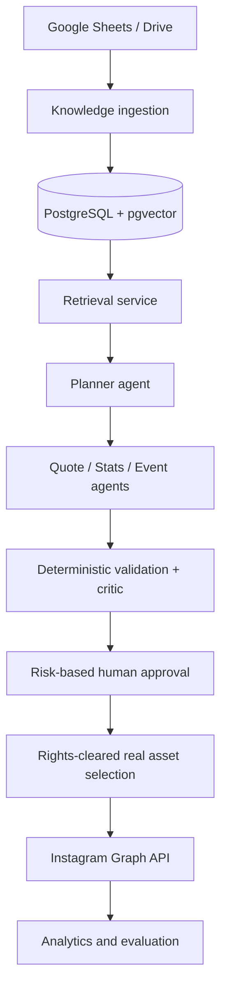

# Dhoni Instagram Agent

A self-hosted, production-oriented agentic AI platform for an MS Dhoni fan account. It will plan, ground, validate, draft, approve, schedule, and publish Instagram content with a complete audit trail.

> **Project status:** Phase 0 — foundation. The repository currently provides local PostgreSQL + pgvector, configuration, migrations, health checks, Python quality tooling, CI, and architecture decisions. It does **not** yet connect to Google, Gemini, n8n, Meta, or Instagram.

## Non-negotiable guardrails

- Never generate, alter, or identity-transform a Dhoni photograph or video.
- Never attribute a quote to Dhoni unless it is in the verified knowledge base with a source URL.
- Keep evidence, prompts, decisions, selected assets, approval state, and publishing results auditable.
- Enforce deterministic validation, licensing, approval, and idempotency rules outside the LLM.
- Keep credentials out of Git, prompts, workflow exports, and logs.

## Architecture



The Phase 0 baseline and target design are documented in [docs/architecture.md](docs/architecture.md). The roadmap is in [docs/implementation-plan.md](docs/implementation-plan.md).

## Local quick start

### Prerequisites

- Docker Desktop with Docker Compose
- Python 3.12+

### Start the database

```bash
cp .env.example .env
# Edit POSTGRES_PASSWORD in .env before starting services.
docker compose --env-file .env -f docker/docker-compose.yml up -d
```

### Install the Python project and apply migrations

```bash
python3 -m venv .venv
.venv/bin/python -m pip install --upgrade pip
.venv/bin/python -m pip install -e '.[dev]'
.venv/bin/python scripts/migrate.py
.venv/bin/python scripts/healthcheck.py
```

The health check verifies database connectivity and the `vector` extension. Stop the local stack with:

```bash
docker compose --env-file .env -f docker/docker-compose.yml down
```

## Development checks

```bash
.venv/bin/ruff check .
.venv/bin/ruff format --check .
.venv/bin/mypy src
.venv/bin/pytest
```

GitHub Actions runs linting, formatting, type checks, and unit tests for pull requests and pushes to `main`.

## Repository map

- `docker/` — reproducible local PostgreSQL + pgvector service.
- `db/migrations/` — ordered, append-only SQL migrations.
- `src/dhoni_instagram_agent/` — application package and configuration/migration primitives.
- `scripts/` — operator commands for migrations and health checks.
- `docs/` — architecture, security, operations, implementation plan, and ADRs.
- `n8n/`, `rag/`, `agents/`, `prompts/`, `evaluations/` — reserved for later phases.

## Engineering workflow

The default branches are `main`, `develop`, and scoped `feature/*` branches. Implement and verify one phase at a time; do not connect production services or store real credentials during local development. See [CONTRIBUTING.md](CONTRIBUTING.md).

## License

MIT. See [LICENSE](LICENSE).
