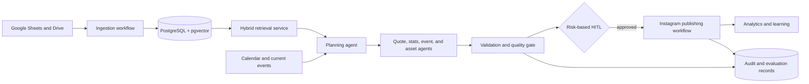

# Architecture

## Scope boundary

Phase 0 establishes the local foundation only. It does not contain a live n8n workflow, model call, Google integration, asset, or Meta API credential.

## Target system

## Cross-cutting controls

1. A model can propose content but cannot override deterministic source, rights, duplicate, approval, or idempotency checks.
2. Every claim carries internal provenance: source, URL, knowledge identifier, and confidence.
3. Any unverified quote, unknown asset rights, or conflicting fact is rejected or escalated; it is not silently published.
4. Authentic Dhoni media is selected from a rights-cleared asset catalogue. Generated or identity-altered Dhoni media is prohibited.

## Phase 0 implementation

- PostgreSQL 17 with `pgvector` and `pgcrypto` extensions runs in Docker.
- SQL migrations are ordered, recorded in `schema_migrations`, and run from a small Python command.
- `audit_events` is the append-only foundation for platform-level operational evidence; domain-specific audit records arrive with their owning features.
- Typed settings derive the database connection from environment variables. `.env` is always ignored.

See [high-level-design.md](high-level-design.md) and [low-level-design.md](low-level-design.md) for component boundaries and interfaces.
